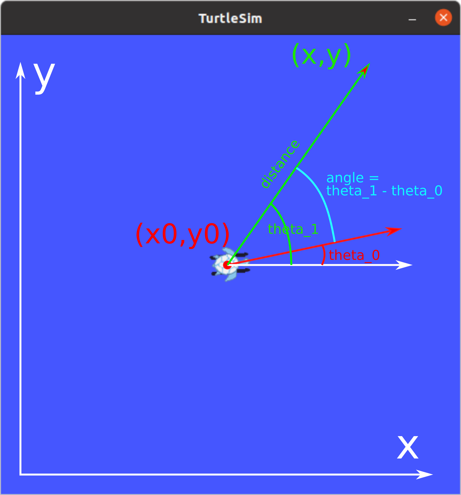

# 03. Python principles, ROS Publisher, ROS Subscriber


---

## Lecture

--- 


### Python principles


{:style="width:400px" align=right}

- Interpreted, high-level programming language
- Name tribute to the comedy group *Monty Python*
- Powerful, still easy to learn, easy to use
- Readability
- **Whitespace indentation**

{:style="width:350px" align=right}

- Dynamically-typed
- Garbage colector and reference counting
- Object oriented programming
- Used in: AI, web applications, scientific computing, and many other areas
- `python3`

---

### Python syntax

```python
import numpy as np
import math

class A:
    def __init__(self, name):
        self.name = name

    def do_something(self):
        # will do something
        print(self.name + " is doing something.")

    def count_to(self, n):
        # count to n, tell if the number is odd or even
        for i in range(n):
            if i % 2 == 0:
                print(i + ", it's even.")
            else:
                print(i + ", it's odd.")
        
  

if __name__ == "__main__":
    a = A("John")
    a.do_something()
    a.count_to(10)
```

## Practice


---


### 1: Move the turtle in a straight line


1. Let's write a ROS node that moves the turtle forward along a straight line for a given distance.
   Let's open a terminal. Let's create `~/ros2_ws/src/ros2_course/ros2_course`
   the `turtlesim_controller.py` file in our directory:


    {:style="width:300px" align=right}


    ```bash
    cd ros2_ws/src/ros2_course/ros2_course
    touch turtlesim_controller.py
    ```


    ---

2. Add a new entry point in the `setup.py` file:

    ```python
    'turtlesim_controller = ros2_course.turtlesim_controller:main',
    ```
    
    ---


3. Copy the skeleton of the program into `turtlesim_controller.py`:

    ```python
    import math
    import rclpy
    from rclpy.node import Node
   
   
    class TurtlesimController(Node):
   
        def __init__(self):
            super().__init__('turtlesim_controller')
   
   
        def go_straight(self, speed, distance):
            # Implement straght motion here
   
   
    def main(args=None):
        rclpy.init(args=args)
        tc = TurtlesimController()
   
        # Destroy the node explicitly
        # (optional - otherwise it will be done automatically
        # when the garbage collector destroys the node object)
        tc.destroy_node()
        rclpy.shutdown()
   
    if __name__ == '__main__':
        main()
    ```
    
    ---

4. Let's start a `turtlesim_node` and then examine the topic,
   with which we can control. In two separate terminal windows:

    ```bash
    ros2 run turtlesim turtlesim_node
    ```

    ```bash
    ros2 topic list
    ros2 topic info /turtle1/cmd_vel
    ros2 interface show geometry_msgs/msg/Twist
    ```

    Or use`rqt_gui`:

    ```bash
    ros2 run rqt_gui rqt_gui
    ```

    ---

5. Import the message type `geometry_msgs/msg/Twist` and create the publisher in `turtlesim_controller.py`:

    ```python
    from geometry_msgs.msg import Twist
    
    #...
    
    # In the constructor:
    self.twist_pub = self.create_publisher(Twist, '/turtle1/cmd_vel', 10)
    ```

    ---


6. We implement the `go_straight` method. Let's calculate how long it takes,
   so that the turtle covers the given distance at the given speed. Publish a message
   with which we set the speed, then wait for the calculated time, after that
   send another message to reset the speed.
   A little help for using the API:


    ```python
    # Create and publish msg
    vel_msg = Twist()
    if distance > 0:
        vel_msg.linear.x = speed
    else:
        vel_msg.linear.x = -speed
    vel_msg.linear.y = 0.0
    vel_msg.linear.z = 0.0
    vel_msg.angular.x = 0.0
    vel_msg.angular.y = 0.0
    vel_msg.angular.z = 0.0

    # Set loop rate
    loop_rate = self.create_rate(100, self.get_clock()) # Hz

    # Calculate time
    # T = ...
   
    # Publish first msg and note time when to stop
    self.twist_pub.publish(vel_msg)
    # self.get_logger().info('Turtle started.')
    when = self.get_clock().now() + rclpy.time.Duration(seconds=T)

    # Publish msg while the calculated time is up
    while (some condition...) and rclpy.ok():
        self.twist_pub.publish(vel_msg)
        # self.get_logger().info('On its way...')
        rclpy.spin_once(self)   # loop rate

    # turtle arrived, set velocity to 0
    vel_msg.linear.x = 0.0
    self.twist_pub.publish(vel_msg)
    # self.get_logger().info('Arrived to destination.')
    ```
    
    ---


7. Build and run the node:

    ```bash
    cd ros2_ws
    colcon build --symlink-install
    ros2 run ros2_course turtlesim_controller
    ```
    
   ---


### 2: Draw shapes

{:style="width:300px" align=right}

1. Let's implement the method for turning with a given angle a
   in `turtlesim_controller.py`, similar to straight motion.


    ```python
    def turn(self, omega, angle):
            # Implement rotation here
    ```
    
    ---

2. Let's implement the straight movement method of drawing a square with a turtle
   and using the methods that perform the turn.

    ```python
    def draw_square(self, speed, omega, a):
    ```

    ---

3. Let's implement the method of drawing any regular shape with a turtle
   using the methods that perform straight movement and turning.

    ```python
    def draw_poly(self, speed, omega, N, a):
    ```

    ---


### 3: Go to function

{:style="width:300px" align=right}

1. Let's examine the topic on which `turtlesim_node` publishes its current position.

    ```bash
    ros2 topic list
    ros2 topic info /turtle1/pose
    ros2 interface show turtlesim/msg/Pose
    ```


    Or use `rqt_gui`:  


    ```bash
    ros2 run rqt_gui rqt_gui
    ```
    
    --- 

2. Let's define a subscriber for the topic and write the callback function.

    ```python
    # Imports
    from turtlesim.msg import Pose
 
        # Constructor
        self.pose = None
        self.subscription = self.create_subscription(
            Pose,
            '/turtle1/pose',
            self.cb_pose,
            10)
    
        # New method for TurtlesimController
        def cb_pose(self, msg):
            self.pose = msg  
    ```
    
   ---


3. We implement the `go_to` method. Let's test it, call it from main.

    ```python
    # ...

    # Go to method
        def go_to(self, speed, omega, x, y):
            # Wait for position to be received
            loop_rate = self.create_rate(100, self.get_clock()) # Hz
            while self.pose is None and rclpy.ok():
                self.get_logger().info('Waiting for pose...')
                rclpy.spin_once(self)
            
            # Stuff with atan2
    
   
    # Main
    def main(args=None):
        rclpy.init(args=args)
        tc = TurtlesimController()
    
        tc.go_to(1.0, 20.0, 2, 8)
        tc.go_to(1.0, 20.0, 2, 2)
        tc.go_to(1.0, 20.0, 3, 4)
        tc.go_to(1.0, 20.0, 6, 2)
    
        # Destroy the node explicitly
        # (optional - otherwise it will be done automatically
        # when the garbage collector destroys the node object)
        tc.destroy_node()
        rclpy.shutdown()  
    ```

   {:style="width:600px"}

---

### Extra: Advanced go to

Write a go to function that uses a proportional controller.

    
---

## Useful links


- [For loops in python](https://www.w3schools.com/python/python_for_loops.asp)
- [Some python functions](https://docs.python.org/3.4/library/functions.html)
- [Turtlesim help](https://docs.ros.org/en/foxy/Tutorials/Beginner-CLI-Tools/Introducing-Turtlesim/Introducing-Turtlesim.html)
- [atan2](https://en.wikipedia.org/wiki/Atan2)


