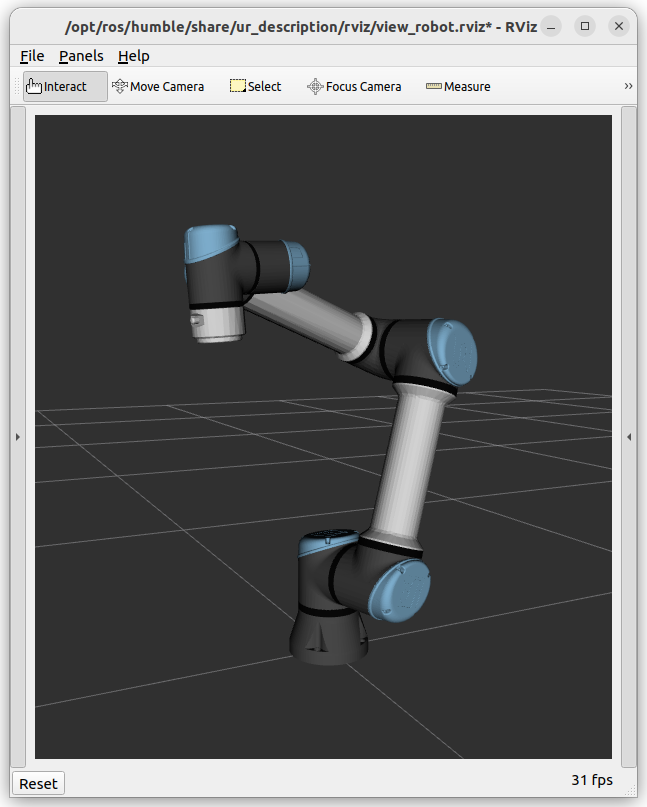

# 09. Kinematics, inverse kinematics, Programming of a simulated robotic arm


---

## Rehearsal

---

!!! warning
    **Test 2** on **December 8.**


### 3D transformations

---


- **Position:** 3 element offset vector

{:style="width:250px" align=right}

- **Orientation:** 3 x 3 rotation matrix
    - additional orientation representations: Euler angles, RPY, angle axis, quaternion

- **Pose:** 4 × 4 transformation matrix
- **Coordinate frame:** origin, 3 axis, 3 base vector, right-hand rule
- **Homogeneous transformations:** rotation and translation together
    - e.g. $\mathbf{R}$ for rotation and $\mathbf{v}$ for translation:

$$
\mathbf{T} = \left[\matrix{\mathbf{R} & \mathbf{v}\\\mathbf{0} & 1 }\right] = \left[\matrix{r_{1,1} & r_{1,2} & r_{1,3} & v_x\\r_{2,1} & r_{2,2} & r_{2,3} & v_y\\r_{3,1} & r_{3,2} & r_{3,3} & v_z\\\ 0 & 0 & 0 & 1 }\right]
$$

- **Homogeneous coordinates:**
    - **Vector:** add 0, $\mathbf{a_H}=\left[\matrix{\mathbf{a} \\ 0}\right]=\left[\matrix{a_x \\ a_y \\ a_z \\ 0}\right]$
    - **Point:** add 1, $\mathbf{p_H}=\left[\matrix{\mathbf{p} \\ 1}\right]=\left[\matrix{p_x \\ p_y \\ p_z \\ 1}\right]$
    - Applying transformations is simpler:

$$
\mathbf{q} = \mathbf{R}\mathbf{p} + \mathbf{v} \to \left[\matrix{\mathbf{q} \\ 1}\right] = \left[\matrix{\mathbf{R} & \mathbf{v}\\\mathbf{0} & 1 }\right]\left[\matrix{\mathbf{p} \\ 1}\right]
$$

- **Degree of freedom** (DoF): number of independent variables (quantities).

---

### Robotics basics

---

{:style="width:400px" align=right}

- Robot structure: **segments** (link) and **joints**
- **Task space** (Cartesian space):
    - Three-dimensional space where the task, trajectories, obstacles, etc. are defined.
    - **TCP** (Tool Center Point): coordinate frame fixed to the end effector
    - **Base/world frame**
- **Joint space**:
    - Quantities assigned to the robot's joints, which can be interpreted by the robot's low-level control system.
    - Joint angles, velocities, accelerations, torques...


---

## Lecture

--- 


### Kinematics, inverse kinematics

---

#### Kinematics

!!! abstract "Def. Kinematics"
    Calculating the pose of the TCP (or anything else) from the joint coordinates.


- Kinematic model
    - Denavit--Hartenberg (DH) convention
    - URDF (Unified Robotics Description Format, XML-based)

If the coordinate systems assigned to the segments are $base, 1, 2, 3, ..., TCP$, the transfomrms between adjacent segments $i$ and $i+1$ are $T_{i+1,i}(q_{i+1})$ (which is a function of the angle of the joint between them), the transfomrs between the base frame and TCP can be written as (for a robot with $n$ joints):

$$ 
T_{TCP,base}(q_1, \cdots, q_n) = T_{TCP,n-1}(q_{n}) \cdot T_{n-1,n-2}(q_{n-1}) \cdots T_{2,1}(q_2) \cdot T_{1,base}(q_1) \cdot base 
$$


#### Inverse kinematics

!!! abstract "Def. Inverse kinematics"
    Calculate the joint coordinates to achieve (desired) TCP (or any other) pose.

---

#### Differential inverse kinematics


!!! abstract "Def. Differential inverse kinematics"
    Which change in the joint coordinates achieves the desired **small change** in the TCP pose (rotation and translation).


- **Jacobi matrix** (Jacobian): a matrix of first-order partial derivatives of a vector-valued function.


    $$
    \mathbf{J} = \left[\matrix{\frac{\partial x_1}{\partial q_1} & \frac{\partial x_1}{\partial q_2} &\frac{\partial x_1}{\partial q_3} & \dots &\frac{\partial x_1}{\partial q_n} \\
    \frac{\partial x_2}{\partial q_1} & \frac{\partial x_2}{\partial q_2} &\frac{\partial x_2} {\partial q_3} & \dots &\frac{\partial x_2}{\partial q_n} \\
    \frac{\partial x_3}{\partial q_1} & \frac{\partial x_3}{\partial q_2} &\frac{\partial x_3}{\partial q_3} & \dots &\frac{\partial x_3}{\partial q_n} \\
    \vdots &\vdots &\vdots &\ddots &\vdots \\
    \frac{\partial x_m}{\partial q_1} & \frac{\partial x_m}{\partial q_2} &\frac{\partial x_m}{\partial q_3} & \dots &\frac{\partial x_m}{\partial q_n} \\}\right]
    $$


- **Jacobi matrix significance in robotics**: gives the relationship between joint velocities and TCP velocity.

    $$
    \left[\matrix{\mathbf{v} \\ \mathbf{\omega}}\right] =\mathbf{J}(\mathbf{q})\cdot \mathbf{\dot{q}}
    $$

    ,where $\mathbf{v}$ is the linear velocity of the TCP, $\mathbf{\omega}$ is the angular velocity of the TCP, and $\mathbf{q}$ is the configuration of the robot.


!!! abstract "Def. Configuration"
    The vector or array containing the current joint angles of the robot.


---

#### Inverse kinematics using Jacobian inverse

1. Calculate the difference between the desired and the current position: $\Delta\mathbf{r} = \mathbf{r}_{desired} - \mathbf{r}_0$
2. Calculate the difference in rotations: $\Delta\mathbf{R} = \mathbf{R}_{desired}\mathbf{R}_{0}^{T}$, then convert to axis angle representation $(\mathbf{t},\phi)$
3. Compute $\Delta\mathbf{ q}=\mathbf{J}^{-1}(\mathbf{q_0})\cdot \left[\matrix{k_1 \cdot \Delta\mathbf{r} \\ k_2 \cdot \mathbf{\omega}}\right]$, where the inverse can be pseudo-inverse or transposed
4. $\mathbf{q}_{better} = \mathbf{q}_{0} + \Delta\mathbf{q}$


---

## Exercise

---

### 1: UR install

---


1. Install the dependencies and the UR driver.

    {:style="width:280px" align=right}


    ```bash
    sudo apt update
    sudo apt upgrade
    sudo apt-get install ros-humble-ur python3-pip
    pip3 install kinpy
    ```


    !!! tip
       Also download the source of the `kinpy` package, it might be useful for understanding the API: [https://pypi.org/project/kinpy/]()


    ---


2. Download the zip containing your source files from Moodle (`ur_ros2_course.zip`).
Copy the `view_ur.launch.py` file to the `ros2_course/launch` folder,
and `topic_latcher.py` to `ros2_course/ros2_course`.
Add the following lines to `setup.py` (launch and entry point):


    ```bash
    import os
    from glob import glob
   
    # ...
   
    data_files=[
        ('share/ament_index/resource_index/packages',
            ['resource/' + package_name]),
        ('share/' + package_name, ['package.xml']),
        # Include all launch files.
        (os.path.join('share', package_name),
            glob('launch/*launch.[pxy][yma]*'))
    ],
   
    # ...
   
    entry_points={
    'console_scripts': [
         # ...
         'topic_latcher = ros2_course.topic_latcher:main',
    ],
    ```


    ---

3. Start the simulator, move the joints using the Joint State Publisher GUI.

    ```bash
    ros2 launch ros2_course view_ur.launch.py ur_type:=ur5e
    ```

    !!! tip
        Try other robots using argument `ur_type` (ur3, ur3e, ur5, ur5e, ur10, ur10e, ur16e, ur20).


---

### 2: Move the robot in joint space

---

1. Create a new python source file named `ur_controller.py` in `~/ros2_ws/src/ros2_course/ros2_course`
folder. Specify the new entry point in `setup.py` in the usual way.
Subscribe to the topic publishing the robot's joint angles (configuration). Create
publisher for the topic that can be used to set the joint angles.

    ```bash
    /joint_states
    /set_joint_states
    ```

    ---

2. Move the robot to the configuration `q = [-1.28, 4.41, 1.54, -1.16, -1.56, 0.0]`.

    ---

### 3. Kinematics

---

1. The simulator publishes the urdf description of the robot in a topic. Subscribe to this topic.


    ```bash
    /robot_description_latch
    ```

    ---


2. Import the `kinpy` package and create the kinematic chain based on the urdf describing the robot
in the callback function just implemented:


    ```python
    import kinpy as kp
   
    # ...


    self.chain = kp.build_serial_chain_from_urdf(self.desc, 'tool0')
    print(self.chain.get_joint_parameter_names())
    print(self.chain)
    ```
    
    ---

3. Calculate and print the TCP pose in the given configuration using the `kinpy` package.


    ```python
    p = chain.forward_kinematics(q)
    ```


---


### 4: Inverse kinematics with Jacobian inverse method

---

Write a method that implements the inverse kinematics problem on the robot using the Jacobian inverse method presented in the lecture.
The orientation is ignored. Move the TCP to the position `(0.50, -0.60, 0.20)`.


1. Write a loop with a stop condition for the length of `delta_r` and `rclpy.ok()`.

    ---

2. Calculate the difference between the desired and the current TCP positions (`delta_r`). Scale with the constant `k_1`.


    ---


3. Set `omega` to `[0.0, 0.0, 0.0]` (ignore orientation).

    ---

4. Concatenate `delta_r` and `omega`.

    ---

5. Calculate the Jacobian matrix in the given configuration using the function `kp.jacobian.calc_jacobian(...)`.

    ---

6. Calculate the pseudo-inverse of the Jacobian matrix `np.linalg.pinv(...)`.

    ---

7. Calculate `delta_q` using the above formula.

    ---

8. Increment the joint angles with the obtained values.

    ---

Plot the TCP trajectory using Matplotlib.

```python
import matplotlib.pyplot as plt

# ...

# Plot trajectory
ax = plt.figure().add_subplot(projection='3d')
ax.plot(x, y, z, label='TCP trajectory',  ls='-', marker='.')
ax.legend()
ax.set_xlabel('x [m]')
ax.set_ylabel('y [m]')
ax.set_zlabel('z [m]')
plt.show()
```


---

### *Bonus:* Inverse kinematics with orientation

---

Complete the solution to the previous problem by including orientation in the inverse kinematics calculation.


---

## Useful links

- [https://github.com/UniversalRobots/Universal_Robots_ROS2_Driver/tree/humble]()
- [https://docs.ros.org/en/ros2_packages/humble/api/ur_robot_driver/usage.html#usage-with-official-ur-simulator]()
- [https://github.com/UniversalRobots/Universal_Robots_Client_Library]()
- [https://pypi.org/project/kinpy/]()
- [https://en.wikipedia.org/wiki/Axis%E2%80%93angle_representation]()
- [https://www.rosroboticslearning.com/jacobian]()